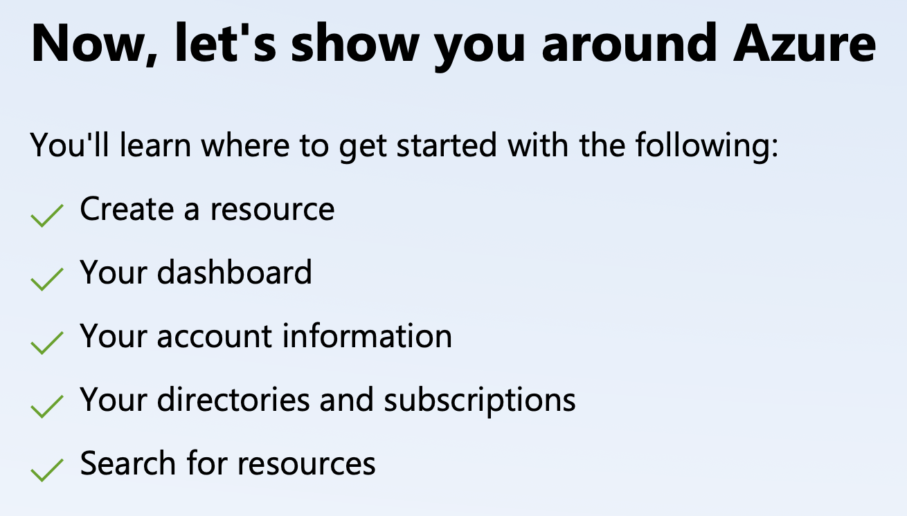
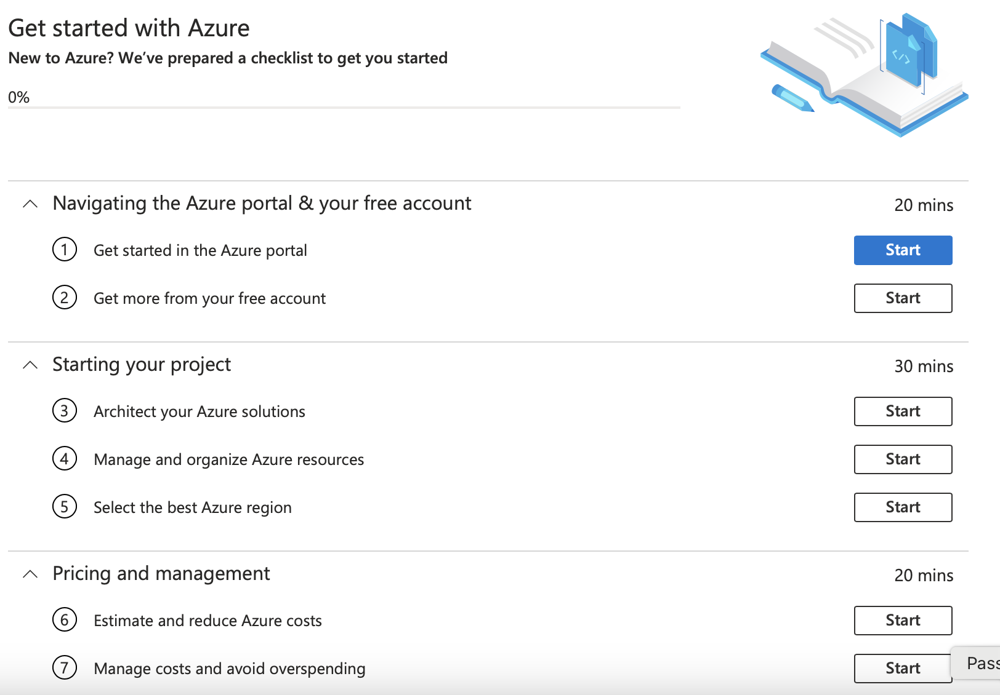
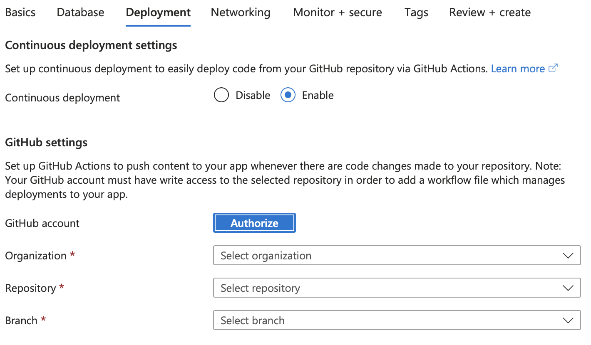
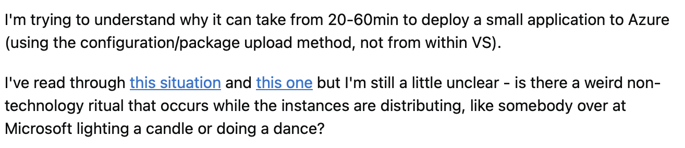
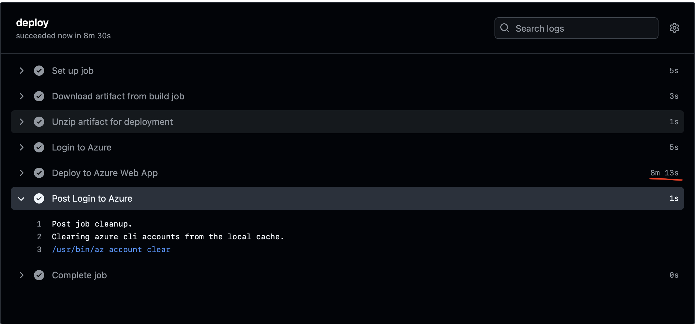
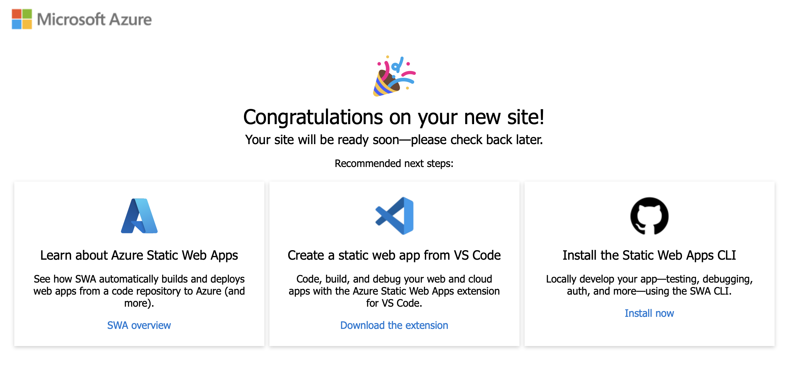
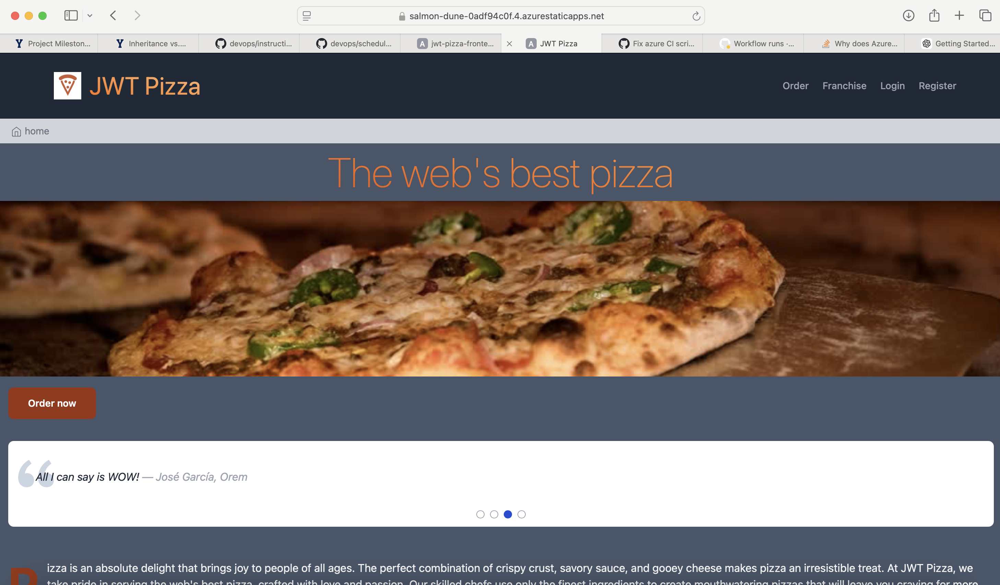
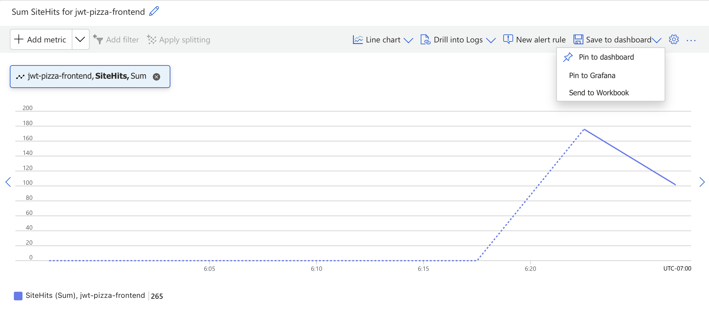
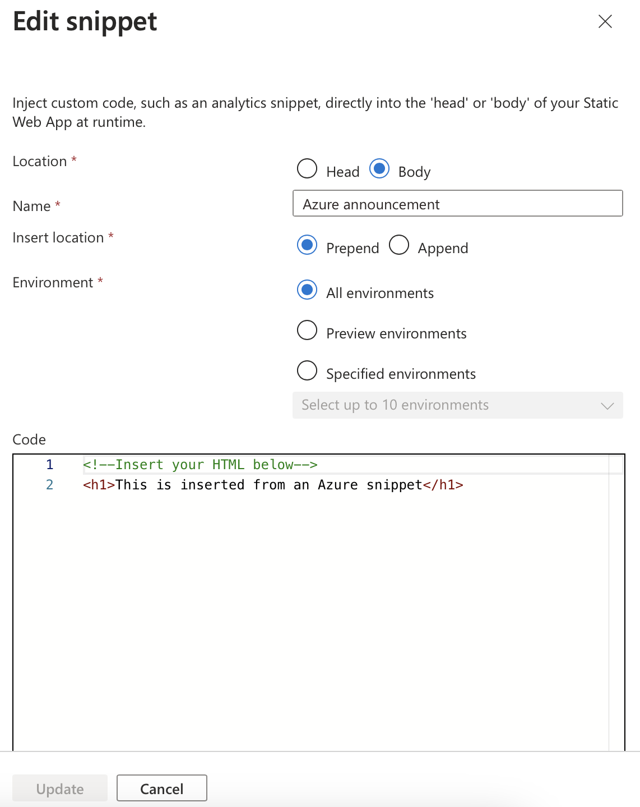
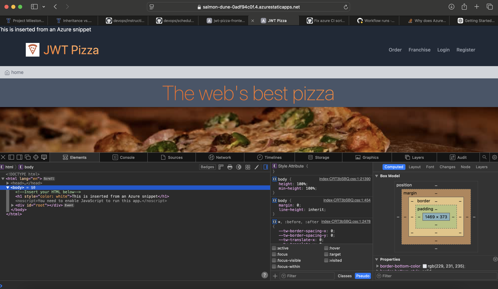

# Curiosity Report

## Introduction

For my curiosity report, I decided to take a look at another cloud computing provider and compare my brief experience with what I have experienced with AWS. I was interested to see what would be different and what sort of approach a different cloud provider would take to offer an alternative to AWS.

I decided to investigate Microsoft Azure and see how quickly I could get something spun up and deployed. I will detail more of what I learned and my experience with it further in this report, but overall I had a very positive experience. The main difference that I can glean between AWS and Azure is abstraction - Azure abstracts many of the details and configuration of cloud computing away from the user and takes care of these things for you, or at least provides you with default configurations without asking. There were some points where I ran into issues that, had I not had experience with AWS and more "low-level" DevOps interactions, I would have had no idea what was going on or how to fix it.

## The Welcoming Experience

It's been long enough since I created my AWS account that I don't remember what it was like at all, so I suppose I don't have a great comparison to make with my experience with Azure. However, I felt like it was already much more beginner-friendly than AWS. I was welcomed with this set of bullet points: 

I was then immediately taken to a "getting started" page with resources to help me as a beginner to Azure: 

Considering myself somewhat familiar with cloud computing I decided to forgo looking at these in much detail.

## Trying (And Failing) At Deploying a Web App

I decided to try getting something tangible out to the world by gracing the internet with my CS 260 project. I wanted to learn as I went along, so I went forward with creating a new "Web App" resource, in Azure lingo. In the process, I was baffled with how few settings and configuration options I was encountering. I didn't need to provide much more than a name for my resource, a region it would be deployed in, settings for a database, and so on.

One of my favorite parts of this experience was how Azure pretty much spoonfed me automation tools. When I was setting up my web app, I was encountered with this, like a boy on Christmas morning seeing what Santa left for him: 

All I had to do was give Azure access to my GitHub repo, and it magically created a GitHub actions script for me. To my astonishment, after I had created my web app resources, Azure pushed the CI pipeline into my repo and it ran.

Interestingly, the deployment of the Web App resources took a little longer than I expected them to: 

To make a long story short, I wasn't able to get my old project spun up and functioning. The resources were made and everything was looking good, but I think I was running into issues with the resources Azure spun up expecting to be listening on a certain port, and my web app was listening on something different due to Vite I think. I didn't remember much about my 260 project's configuration so figured I should lower my expectations a little bit. However, I did learn that one consequence of all of the abstraction going on with Azure is that you could run into an unexpected error down the line that you had no control over or idea of previously.

## A Successful and Seemless Static Deployment

I decided that to get something out there quickly I could begin with how this class began - a classic static deployment. One good thing about Azure is its resources you can create are pretty well named, so I quickly found an option to create a "Static Web Page". Some notes about creating this that I thought was cool:

- It was free.
- It was fast.
- It created a [CI pipeline](/.github/workflows/azure-static-web-apps-salmon-dune-0adf94c0f.yml) for me that worked perfectly.
- I didn't have to create any IAM roles or stuff that I often find a little frustrating when working in AWS.

In probably 10 minutes I had the JWT Pizza frontend deployed to the world in [another wonderful domain](https://salmon-dune-0adf94c0f.4.azurestaticapps.net).

## Nice (But not the best) DevOps Resources

I found that Azure tried to provide good DevOps tools for you so that you didn't have to go anywhere else for them. In some places I think they did a really good job at this, like the automatically generated CI pipelines. I did find that they provided some monitoring and alerting tools as well. I by no means looked very deeply into these, but I wasn't too impressed with these tools right off the bat. I generated some traffic to hit the static frontend and get some metrics going. The best metric I could get to work was just a general "SiteHits" count. 

Another thing I found that I thought was sort of odd was an ability to inject HTML into your static web page through an Azure "snippet". I tried this out and successfuly got a message showing up on my page. 

## Conclusion

I can see why AWS has, from what I understand, a majority of the world's attention when it comes to cloud computing. They offer robust and extensive services that appeal to professional developers and work well. I am, in the end, glad that our class focused on AWS as a cloud computing service because of the high transparency of their services and the relatively low level of abstraction they use. At the same time, I was pretty excited about my brief experience with Azure, and I found the immediate usability of their services very refreshing.
